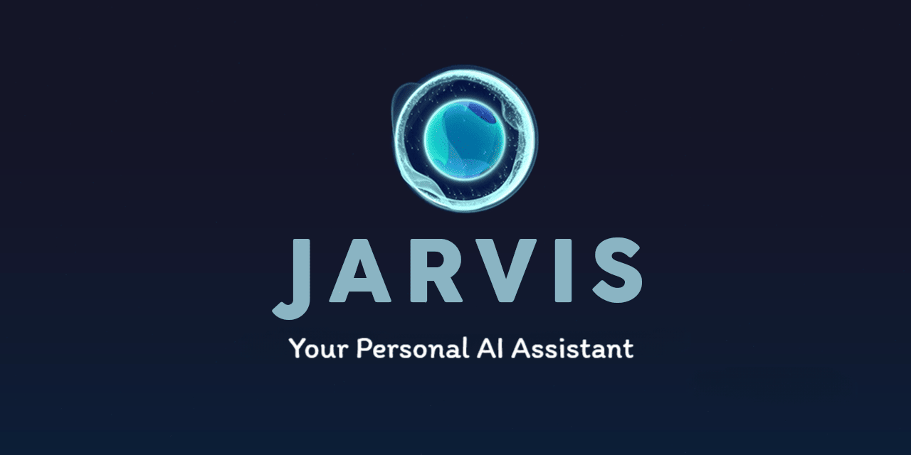

# Jarvis - Your AI Assistant Inspired from Iron Man

## Description:
Jarvis is an advanced AI assistant, inspired by the iconic Iron Man movie, designed to simplify your daily tasks and enhance your productivity. With its diverse range of capabilities, Jarvis brings the power of artificial intelligence right to your fingertips.

## Features:

- Messaging: Jarvis enables you to effortlessly send WhatsApp messages and voice messages, making communication more efficient and convenient.

- Weather Information: Stay updated on the latest weather conditions and forecasts in your area, providing you with valuable insights to plan your day effectively.

- Time Telling: With Jarvis, you can instantly inquire about the current time, ensuring you never miss an important appointment or deadline.

- Crypto Prices: Stay on top of the volatile cryptocurrency market by accessing real-time prices, allowing you to make informed decisions.

- Language Translation: Break down language barriers with Jarvis's built-in translation capabilities, facilitating seamless communication across different languages.

- Wikipedia Search: Jarvis harnesses the vast knowledge of Wikipedia to provide you with quick and accurate answers to your queries, ensuring reliable information at your fingertips.

- WhatsApp Calling: Effortlessly make WhatsApp calls using Jarvis, making it easier to connect with friends, family, or colleagues anytime, anywhere.

- Music Playback: Enjoy your favorite tunes with Jarvis's integrated YouTube music player, providing a personalized and immersive listening experience.

- News Headlines: Stay informed and up-to-date with the latest news headlines, keeping you in the know about current events and trending topics.

- Intelligent Chat: Engage in interactive conversations with Jarvis, allowing you to ask questions, seek guidance, or simply enjoy friendly banter, all powered by advanced natural language processing.

## Requirements:

- Python 3.9.8 (As there are some packages like pyttsx3 that do not support 3.10 yet).
- OpenWeatherMap API Key (To fetch the weather information in your local area).
- NewsAPI API Key (To fetch the latest headlines from your favorite news paper).
- WhatsApp to be installed on your system (For whatsapp automation such as, voice calling, voice messaging and text messaging).
- There is a voice package that you need to download, to get a voice close to Jarvis's voice. If you do not wish to install it, you can change the voice to sapi5 in the env file and proceed to use the default text to speech engine of microsoft.
- Currently only works on Windows (But soon will be available for Linux and MacOS)
- Last but not the least, You need 8GB or more RAM on your computer (For running local AI model on your computer, its not necessary as Jarvis only uses gpt3 API but incase if the request fails or something, it uses the local AI model. So its recommended).

## Commands:

**Saying ``Jarvis`` Will wake Jarvis up, he will stay awake for 300 seconds. You can say any of the following commands during that 300 seconds or you can just talk with him casually. After 300 seconds he goes back to sleep and can be waked up by saying Jarvis again.**

### WhatsApp automation:
> **Note that Jarvis should be running in background and WhatsApp should be open in the foreground in order for it to work.**

- To send WhatsApp message, you can say:
 ``send a message to <PERSON NAME>`` 
 here it will ask you what message would you like to send to that person you specified. Once you tell the message to it, it will then begin to search the person in whatsapp, type the message and send the message.

- To call a person on WhatsApp, you can say:
``make a call to <PERSON NAME>``  
This will search the person again, and call them.

- To hang up an ongoing call on WhatsApp, you can say:
``cut the call``
This will hang up the ongoing call.

- To send a voice message on WhatsApp, you can say:
``send a voice message to <PERSON NAME> <MESSAGE>``   
Jarvis will search the person, click on the record button and speak. Then send the message.

Jarvis combines cutting-edge technologies to deliver a comprehensive and intuitive AI assistant experience. Embrace the future of productivity and let Jarvis streamline your daily routine, enabling you to focus on what truly matters.
